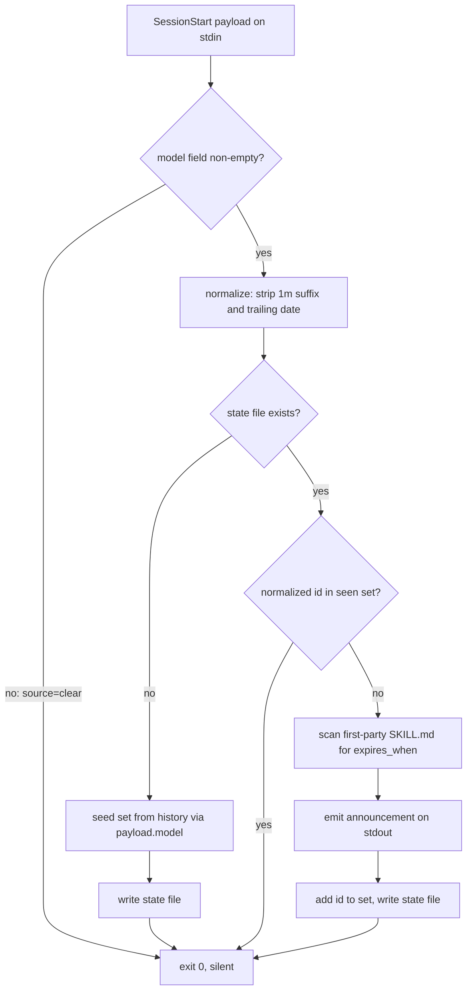

# Skill Durability Loop - Plan

**Target repos:** this work spans two. `claude-skills` (this document's home) and `dotclaude` (the git repo at `~/.claude`, where hooks and `settings.json` are tracked under an allowlist `.gitignore`). Paths below are repo-relative and labelled with their repo.

---

## Goal Capsule

- **Objective:** audit the skills against the model actually running today, and make that audit recur when a genuinely new model arrives — without a scheduled job and without a standing token cost.
- **Authority hierarchy:** this plan, then repo conventions, then implementer judgment on details left open.
- **Execution profile:** four units across two repos. Sequence is U1 (convention) then U4 (the audit) then U2 (the hook); U3 is independent of all three.
- **Stop conditions:** stop and surface if the U1 fixture shows `--fix` stripping a column-0 key (KTD-9 is then wrong and the convention needs a different carrier), or if the hook announces on a session where no new model appeared (KTD-1 is then wrong). Both invalidate the design rather than the code.
- **Tail ownership:** implementer commits per unit; no PR strategy is imposed.

---

## Product Contract

### Summary

Audit the 38 first-party skills against the current model, tagging each perishable one with what would make it redundant, then add a loop that re-raises the question when a model never seen on this machine appears. Two mechanisms: a SessionStart hook in `dotclaude` that watches for unseen model IDs, and a caller-supplied model flag in `claude-skills`' benchmark aggregator. The audit is the deliverable; the hook is the cheap part that keeps it from decaying again.

### Problem Frame

Skills that compensate for a model's weakness expire when a new model absorbs that capability, and a stale reasoning scaffold can actively fight a model that no longer needs it. Skills that encode private context — VPS layout, iMGA Protean, TX legislature domain knowledge — never expire from a model release. Today nothing distinguishes the two.

**The audit has never run.** Sixteen of the nineteen first-party skills in `claude-skills` were last touched between 2026-03-25 and 2026-05-31; only `web-reader`, `writing`, and `digest` have been touched since. In that window the model under them turned over repeatedly — captured history shows opus 4.5 through 4.8, sonnet 4.5 through 5, fable, haiku, and glm all in routine use. Every transition that should have prompted a recheck happened silently. So the problem is not that an expensive audit recurs too rarely; it is that it has not happened once, and nothing has ever asked for it.

That also disposes of the cost premise. Classifying 38 skills is one agent per skill, run in parallel, each answering a single question against one file. The reason it never happened is not expense.

The durability question has a second half, though, and that half is real: two prior attempts at scheduled work died the same way — `cos-cron` had 11 jobs disabled on quota, and the hyperscale crons went dark when credits ran out. A monthly job re-evaluating every skill is the shape that gets paused and never comes back. So the audit runs now, by hand, once; the recurrence rides on an event that costs nothing when it does not fire.

Separately, `plugins/skill-creator/skills/skill-creator/scripts/aggregate_benchmark.py` emits `metadata.executor_model` and renders it as `**Model**:` — but hardcodes it to the placeholder `"<model-name>"`. No benchmark output exists in either repo yet, so this is a defect waiting on its first real run rather than a corpus of bad provenance.

### Requirements

**The audit**

- R10. Every first-party skill is classified against the current model as private-context (durable) or a bet that a model, tooling, or infra quirk stays broken (perishable).
- R11. Every skill classified perishable carries the condition that would make it redundant, written so it can be checked later.

**Expiry convention**

- R8. A skill can declare what would make it redundant via an `expires_when:` frontmatter key that both the Claude Code loader and `skill-doctor` ignore.
- R12. The convention survives a `skill-doctor --fix` pass, demonstrated by a fixture that reproduces the deletion failure rather than by a test that cannot fail.

**Model-arrival detection**

- R3. A SessionStart hook announces, in-session, when a model ID that has never been seen on this machine becomes active.
- R4. Detection treats context-window and date variants of an already-seen model as the same model.
- R5. The hook stays silent when the payload carries no model or an empty one, and never reads absence as a change.
- R6. A session where no new model appears costs one state-file read and nothing else — no scan of skill files, no scan of history.
- R7. The seen-model set is seeded from captured event history exactly once and persisted, so the loop starts quiet and never re-pays the seed cost.
- R9. The announcement names the skills whose declared condition is now worth rechecking.

**Benchmark provenance**

- R1. `aggregate_benchmark.py` records the models that produced a benchmark, replacing the `<model-name>` placeholder in `metadata.executor_model` and `metadata.analyzer_model`.
- R2. The recorded values are supplied by the caller, so `claude-skills` stays self-contained and installable by anyone.

### Scope Boundaries

- Covers the 38 first-party skills across `claude-skills` and `claude-skills-private`. Third-party plugins are out — their content is not yours to tag.
- The audit is a classification pass, not a benchmark. It answers "is this a private fact or a bet?" from the skill's content. It does not run evals.
- Retesting a specific skill against a specific model stays manual and out of scope. The hook names what is due; you decide what to do about it.

#### Deferred to Follow-Up Work

- **Memories (~90 entries).** The same durable-vs-perishable split applies, and the naming convention already half-encodes it: `reference-`, `project-`, and `user-` are private facts that never expire from a model release; `feedback-` is the mixed pile worth auditing. Within `feedback-`, three clocks are tangled: `feedback-no-honest-part-framing` patches a model verbal tic (model clock — this loop's trigger already catches it); `feedback-code-worker-auto-commits-wip` and `feedback-grok-lane-blocked-in-auto-mode` expire when an agent or the harness is fixed (tooling clock); `feedback-vps-deploy-swap-pm2-restart-bug` expires when pm2 changes (infra clock). Some entries look mislabelled — `feedback-vps-deploy-from-working-tree` is an infra fact, not guidance, and would sort to `reference-`. The cheap part: memories need no new trigger. The same hook can name expiring memories alongside skills — a wider read, not a second mechanism. The `feedback-` pile is the likeliest place for real dead weight.
- **Widening `setup-audit` to cover plugin skills.** It excludes them today. U4 covers the durability question for this pass; the semantic audit is a separate concern.
- **Fixing `skill-doctor`'s search roots.** Its own help text promises `--root <repo>` works against source repos; it does not (KTD-10). U1 works around it with a staging root rather than fixing a pre-existing defect this plan is merely the first to depend on.
- **`skill-doctor` freshness and cache GC.** Marketplace staleness via `git log -1` per marketplace, and cache GC over the 367 cached `SKILL.md` files. Note that marketplace checkouts at `~/.claude/plugins/marketplaces/` sit outside both search roots.
- **Automating the baseline-arm retest.** Structural, not operational. The `with_skill`/`without_skill` split lives in `skill-creator`'s SKILL.md prose, not in code — no script runs an arm and no `--arm` flag exists. The aggregator is arm-agnostic and would absorb a third config dir, but `aggregate_results` only deltas the first two configs, and the viewer requires the exact names `with_skill`/`without_skill` to render styled.

---

## Planning Contract

### Key Technical Decisions

- KTD-1. **Trigger on "never seen before", not "changed since last session".** This is the decision the whole detection design rests on. Captured history holds 13 distinct raw model IDs across opus, sonnet, haiku, fable, and glm — you switch models routinely. A last-model comparison would fire on every `/model` switch and become noise within a day, which is the "actively counterproductive" failure this loop exists to prevent. Set membership answers the real question: has a model I have never run appeared?
- KTD-2. **Normalize before the set test.** Strip the `[1m]` context suffix and any trailing `-YYYYMMDD` date. History carries both `claude-opus-4-6[1m]` and `claude-opus-4-6`, and both `claude-opus-4-5-20251101` and `claude-opus-4-8`. Verified: the 13 raw IDs collapse to exactly 10 normalized ones, and `glm-4.7:cloud` passes through intact. Accepted cost — a re-trained snapshot republished under a seen family name would never announce.
- KTD-3. **Absent or empty `model` is not a change.** Empirically `source=clear` never carries the field (0 of 91 in current-version July data), `source=startup` always does (48/48), `source=compact` always does (186/186), `source=resume` sometimes (4/7). Absence means no signal; exit silently. Guard on truthiness, not presence — an empty string is present, would normalize to `""`, would miss the set, and would announce an arrival naming nothing. No empty values appear in 3,157 captured events, so the edge is unproven, but truthiness covers both for free.
- KTD-4. **New hook, not an extension of `initialize-session.ts`.** That file writes only to stderr today, which does not reach the model's context; making it write stdout would put its output into every session's context and mix "initialize state" with "talk to Claude". Its apparent reuse value is illusory — `checkForUpdates()` is invoked fire-and-forget at line 132 and `main()` falls through to `process.exit(0)` at line 143, so its async body never resolves and its version log has never printed. The house convention is one hook, one job. The stdout choice has a working precedent: `load-core-context.ts` injects SessionStart context with a bare `console.log` at line 85.
- KTD-5. **Seed the seen-set once, persist it, and prefilter the scan.** Three things the naive reading gets wrong. **(a) The seed path must write the state file.** Seeding that exits without persisting means the no-state-file branch repeats every session forever — silently, since errors are swallowed. **(b) The corpus is 1.68 GB, not 3,157 records.** `history/raw-outputs/YYYY-MM/YYYY-MM-DD_all-events.jsonl` is 165 files, 369,521 lines, 1.68 GB; SessionStart is 3,157 of those lines (0.85%). Measured at ~6s parsing every line, ~1.5s with a `line.includes('SessionStart')` substring reject before `JSON.parse`. Take the prefilter; both fit the 60s hook timeout but only one is defensible as a blocking read at session start. **(c) The seed reads a different shape than the live path.** Captured events nest the payload — `{"hook_event_type":"SessionStart","payload":{...,"model":"claude-sonnet-5"}}` — while live stdin carries `model` at the root. All 1,006 historical values live at `payload.model`. An implementer reusing one extractor gets an empty set, exits silently exactly as a correct seed would, and then announces every model you own one at a time.
- KTD-6. **Gate the tag scan behind the detection.** On the ~99% of sessions where the normalized ID is already in the set, the hook reads one state file and exits. Only a genuinely new model pays for scanning 38 `SKILL.md` files.
- KTD-7. **`--executor-model` and `--analyzer-model` are caller-supplied, and they are the subagents' models, not the orchestrator's.** `claude-skills` is public and must not read your private PAI state, which rules out reading the hook's state file. But the orchestrator is not the executor: `skill-creator`'s SKILL.md spawns two subagents per test case to run the arms, and a separate grader subagent to analyze. Subagents inherit the parent model only when no override is set, so an orchestrator passing its own ID silently records the wrong producer whenever an override or agent-level `model:` frontmatter applies — the exact wrong-provenance outcome R1 exists to prevent. The orchestrator passes the model it *dispatched the eval subagents with*, and the grader's model separately.
- KTD-8. **`expires_when:` is present only on perishable skills.** Absence means durable. `expires_when: never` is permitted to record that a skill was checked and found durable, but is never required — U4 records durable classifications in its own output, not by tagging 30 files with a no-op.
- KTD-9. **The key sits unindented at column 0, never under a multi-line `description:`.** `skill-doctor` ignores unknown frontmatter keys — its whole check is presence of `name`/`description` plus a length band, with no allowlist (`plugins/skill-doctor/bin/skill-doctor.mjs` lines 125-136). But `--fix` rewrites the description with `/^description:\s*.*(?:\r?\n[ \t]+\S.*)*/m` (line 362), whose trailing group swallows indented continuation lines. An indented `expires_when:`, or one placed directly beneath a wrapped `description:`, is silently deleted the next time anyone runs `--fix`. Column 0 is not style — it is what keeps the tag alive. Of 19 first-party skills, `overnight-optimizer` is the only one with a wrapped description, so it is where this bites first.
- KTD-10. **`skill-doctor` cannot see the source repo; verify against a staging root.** Its `SEARCH_ROOTS` are `join(flags.root, '.claude/skills')` and `join(flags.root, '.claude/plugins/cache')`. `claude-skills` has no `.claude/` directory, so `--root /Users/james/Projects/claude-skills` returns "No SKILL.md files found" and exits 2 — the tool's own help text ("Run `--fix` against source repos") is broken. The default root scans installed copies under `~/.claude/plugins/cache/`, not the repo files U4 tags. So every U1 check runs against a temp tree shaped like the cache layout. This also confines `--fix`'s blast radius: it takes no path argument, so an unscoped run rewrites every fixable skill under root via live billed API calls.

### High-Level Technical Design

The hook's decision path, where each branch either exits silently or narrows toward the announcement:

Seeding writes and exits without announcing: on first run every model is unseen, so announcing would fire for all ten at once. The write node on the seed path is what makes seeding one-time — without it the branch repeats every session and re-pays 1.68 GB forever.

### Assumptions

- The SessionStart `model` field keeps its current shape (full API model ID, `[1m]` suffix when the 1M variant is active). The field's presence is harness-version-dependent — across full history `startup` carries it only 374/1497 times, though current-version data is 48/48. KTD-3's exit-silent rule makes that failure safe rather than noisy, but it is silent: a harness change dropping the field stops the loop without saying so.
- Seeding depends on `capture-all-events.ts` having run continuously. It is a peer SessionStart hook under the same `"*"` matcher. If history is pruned or that hook is disabled, a reseed produces a partial set and spurious announcements. A 3-month window would already miss 4 of the 10 IDs, which is why the seed reads all of history rather than a recent slice.

---

## Implementation Units

### U1. `expires_when:` convention and its verification harness

- **Goal:** define the frontmatter key, and build the fixture that proves the column-0 rule is load-bearing rather than incidentally true.
- **Requirements:** R8, R12.
- **Dependencies:** none. Gates U4.
- **Repo:** `claude-skills`.
- **Files:** a new reference under `plugins/skill-creator/skills/skill-creator/references/` documenting the key.
- **Approach:** the key's value is the condition that would make the skill redundant, written so it can be checked later — "Claude stops X unprompted" rather than "maybe someday". Document that the key's consumer is a session-start hook the reader supplies themselves, and state the contract (key name, value shape) so the public artifact stands alone rather than dangling on a private reader. Per KTD-9, document the column-0 rule as a hard requirement with the reason, not as style guidance.
- **Test scenarios:**
  - A fixture skill with a deliberately wrapped multi-line `description:` carries `expires_when:` twice — once at column 0, once as an indented continuation line. After `--fix`, the column-0 key survives and the indented one is gone. The negative control is the point: without it, the test passes whether or not column 0 matters.
  - The fixture's description must trip a fixable finding (over the 600-char band) or `--fix` skips the file and the regex never runs. A skill inside the 30-600 band — like `autoreason` at 367 chars — produces no finding and yields a green result that proves nothing.
  - `skill-doctor` emits no error or warning on the tagged fixture beyond the description-length finding the fixture deliberately carries.
- **Verification:** stage the fixture at `<tmp>/.claude/plugins/cache/claude-skills/<plugin>/v0/skills/<skill>/SKILL.md` and run `node plugins/skill-doctor/bin/skill-doctor.mjs --root <tmp>` (KTD-10 — the repo path finds nothing). Run `--fix` against the same `--root <tmp>` so the rewrite cannot touch the real repo. Note: `--fix` exits 2 without `ANTHROPIC_API_KEY` and makes a live billed call. Never run it unscoped or against a real skill — `grill-me`'s 661-char description makes it exactly the fixable case, and an unscoped run would permanently overwrite it with generated text.

### U4. Audit and tag the first-party skills

- **Goal:** answer, for every first-party skill, whether it encodes private context or bets that a model stays weak — and tag the bets.
- **Requirements:** R10, R11.
- **Dependencies:** U1 (the key and the column-0 rule must exist first).
- **Repo:** `claude-skills` and `claude-skills-private`.
- **Files:** first-party `SKILL.md` files across both repos (19 in `claude-skills`; the balance in `claude-skills-private`).
- **Approach:** one read-only agent per skill, launched in parallel, each answering a single question from the skill's content: does this exist because of something only James can see, or because of something the model could not do? Reasoning scaffolds are the expected perishable category — `autoreason`, `annealing-prompts`, `grill-me`, `improve`, `plan-review`, `engineering-discipline` all exist to make a model think better, which is what new models absorb. Private-context skills (`vps-ops`, `imga-systems`, `obsidian-vault`, `tx-legislature`, `hearing-capture`) are the expected durable category. Both lists are priors to check, not conclusions — classify from content, not from the name. Tag only the perishable ones (KTD-8); record the durable classifications in the unit's output so the pass is auditable without touching 30 files. `overnight-optimizer` has a wrapped description and is the one file where the KTD-9 rule actually bites — place its key at column 0 and verify explicitly.
- **Test scenarios:** every first-party skill appears in the classification output with a verdict and a one-line reason. Every skill tagged perishable carries a condition that names an observable model behavior, not a date. No tagged key sits indented.
- **Verification:** re-run the U1 staging-root check over the tagged skills as a batch and confirm no new findings. Grep the tagged files for `^expires_when:` and confirm the count matches the perishable verdict count — a mismatch means a key landed indented or a tag was missed.

### U2. `model-watch` SessionStart hook

- **Goal:** announce, once, when a model never seen on this machine becomes active — and stay silent otherwise.
- **Requirements:** R3, R4, R5, R6, R7, R9.
- **Dependencies:** U4 (tags must exist for the announcement to say anything).
- **Repo:** `dotclaude`.
- **Files:** `hooks/model-watch.ts`, `hooks/model-watch.test.ts`, `settings.json`.
- **Approach:** a bun script following the house shape — read `Bun.stdin.text()`, `JSON.parse`, do one job, `process.exit(0)`, all I/O in a try/catch that swallows errors so session start never blocks. State is a JSON object at `$PAI_DIR` (set to `~/.claude` in `settings.json`), mirroring the `.current-session` marker written by `initialize-session.ts` at lines 112-119; the `.gitignore` allowlist includes `!hooks/*.ts`, so the hook and its test are both committable while the state file is ignored. The announcement goes to **stdout** — stderr does not reach the model's context. All logic must be synchronous before `process.exit(0)`; the dead `checkForUpdates()` in `initialize-session.ts` is the counter-example. Register after `initialize-session.ts` under the existing `"*"` matcher. Seed per KTD-5: substring-prefilter each line, read `payload.model`, and **write the state file before exiting**.
- **Patterns to follow:** stdin parse and silent-failure shape from any hook in `hooks/`; state-file shape from `initialize-session.ts` lines 112-119; stdout injection from `load-core-context.ts` line 85; test file placement from the untracked `hooks/context-threshold-check.test.ts`.
- **Test scenarios:**
  - Normalization collapses `claude-opus-4-8[1m]` and `claude-opus-4-8` to one ID; collapses `claude-opus-4-5-20251101` to `claude-opus-4-5`; leaves `glm-4.7:cloud` intact.
  - A payload with no `model` field (the `source=clear` case) produces no output and does not mutate the state file. A payload with `model: ""` behaves identically — it must not announce an empty ID.
  - A payload whose normalized ID is already in the seen set produces no output and reads no history.
  - A payload whose normalized ID is absent from a populated seen set produces an announcement on stdout naming the new ID, and the ID is present in the state file afterward.
  - A second identical unseen-model payload produces no output — the announcement fires once.
  - No state file present: the hook seeds from history, produces no announcement, **and the state file exists afterward with a non-empty set**. Assert the count against current history (10 IDs) so an extractor reading the wrong shape fails loudly instead of silently seeding empty.
  - A corrupt or unreadable state file is treated as absent — reseed, announce nothing, never throw, and leave a valid state file behind.
  - With no skills tagged, the announcement still names the model arrival and omits the skill list.
- **Verification:** `bun test hooks/model-watch.test.ts` passes; a real session start on an already-seen model emits nothing and touches no history file.

### U3. Populate benchmark model metadata

- **Goal:** stop `benchmark.md` from claiming `**Model**: <model-name>` on the first benchmark that is ever produced.
- **Requirements:** R1, R2.
- **Dependencies:** none.
- **Repo:** `claude-skills`.
- **Files:** `plugins/skill-creator/skills/skill-creator/scripts/aggregate_benchmark.py`; `plugins/skill-creator/skills/skill-creator/SKILL.md`.
- **Approach:** add `--executor-model` and `--analyzer-model` argparse flags and thread them through `generate_benchmark`, replacing the hardcoded placeholders at lines 267-268. The renderer at line 296 already prints the value. Update SKILL.md's benchmark step per KTD-7: the orchestrator passes the model it dispatched the eval subagents with, and the grader's model separately — not its own ID, which is only correct when the subagents inherited it. When a flag is omitted, keep the current placeholder rather than guessing; a wrong provenance is worse than a visibly absent one. Treat an empty-string value the same as omitted.
- **Execution note:** the intended shape is documented in `references/schemas.md` lines ~228-229, but note the asymmetry — line 228 carries a real ID (`claude-sonnet-4-20250514`) while line 229 carries the role string `most-capable-model`. Record actual model IDs in both; the role string is not provenance.
- **Test scenarios:** running the aggregator with both flags writes those values into `metadata.executor_model` and `metadata.analyzer_model` and renders the executor under `**Model**:`; running without them leaves the placeholders and does not crash. `skill-creator` has no test framework, so this is a manual run — not a new pytest suite.
- **Verification:** no benchmark output exists in either repo today, so there is no existing directory to run against. Produce a first benchmark from an existing `evals.json`, then confirm `benchmark.json` carries the passed models and `benchmark.md` renders the executor under `**Model**:`.

---

## System-Wide Impact

`model-watch.ts` runs on every session start, so a defect there is felt everywhere. Three mitigations are load-bearing rather than defensive: all I/O sits in a try/catch that exits 0, the tag scan is gated behind the set test, and the seed writes its state file so the expensive branch runs once. The hook adds a fourth bun spawn to session start (~20-30ms on the common path).

The swallow-all-errors try/catch has a failure mode worth naming: a persistently unwritable `$PAI_DIR` converts the most expensive branch into the steady state, silently. If the seed cannot persist, the hook re-scans 1.68 GB every session and never says why.

The announcement enters context on the rare sessions it fires, competing with the PAI core-context block that `load-core-context.ts` injects. Keep it to one or two lines.

---

## Risks & Dependencies

- **`skill-doctor --fix` can silently delete the tag.** Its description-rewrite regex consumes indented continuation lines, so a misplaced `expires_when:` disappears with no error and the skill quietly leaves the audit set. KTD-9 is the mitigation and U1's fixture is the proof. The fixture must reproduce the deletion, not merely survive — a test that cannot fail is worse than no test, because it certifies the convention as verified.
- **The announcement fires once per model and then never again.** By design (KTD-1), but it means the due-list lives or dies with whichever session happens to catch it. A new model arrives, you start a session to do something else, two lines enter a context whose purpose is something other than auditing, and the state file records the model as seen. If that proves too easy to miss in practice, the fix is to split "seen" from "acknowledged" and re-announce until cleared — one extra field on the already-gated rare path. Not built now; the audit landing in U4 is what makes the first announcement worth anything.
- **The `model` field is documented as optional and its presence is harness-version-dependent.** A harness change that drops it degrades to permanent silence, not false alarms — safe by construction (KTD-3), but silent, so the loop would stop working without saying so.
- **Normalization is a guess about future model IDs.** The rules cover every ID in history, but a new naming shape would read as a new model and fire once, spuriously. One false announcement is cheap. The inverse is the real cost: a re-trained snapshot republished under a seen family name never announces at all (KTD-2).
- **The audit is a judgment pass, not a measurement.** U4 classifies from content. It can be wrong about a specific skill in a way only an eval would catch, and this plan does not run evals. That is the accepted trade for doing it at all.

---

## Sources / Research

- Empirical SessionStart payload distribution, from `~/.claude/history/raw-outputs/**/*_all-events.jsonl` (n=3,157, Jan-Jul 2026): `model` present in 1,006, all at `payload.model` as plain strings. By source in current-version July data: `startup` 48/48, `compact` 186/186, `resume` 4/7, `clear` 0/91. Across full history `startup` carries the field only 374/1497 — presence is harness-version-dependent. Observed raw IDs: `claude-opus-4-8[1m]`, `claude-opus-4-7[1m]`, `claude-opus-4-6[1m]`, `claude-opus-4-6`, `claude-fable-5`, `claude-sonnet-4-6`, `claude-opus-4-5-20251101`, `claude-opus-4-8`, `claude-sonnet-4-5-20250929`, `claude-sonnet-5`, `claude-haiku-4-5-20251001`, `claude-fable-5[1m]`, `glm-4.7:cloud` — 13 raw, collapsing to exactly 10 normalized.
- Seed corpus magnitude: 165 files, 369,521 lines, 1.68 GB; SessionStart is 3,157 lines (0.85%). Measured ~6s parsing every line, ~1.5s with a substring prefilter. Largest single file ~44 MB.
- Skill ages from `git log -1` per first-party `SKILL.md` in `claude-skills`: 16 of 19 last touched 2026-03-25 through 2026-05-31; `web-reader`, `writing`, `digest` in July.
- `skill-doctor` internals: `SEARCH_ROOTS` at `.claude/skills` and `.claude/plugins/cache`; `checkFrontmatter` lines 125-136 with no key allowlist; `--fix` description regex at line 362; `--fix` requires `ANTHROPIC_API_KEY` and processes only skills already carrying a description-length or dark-skill finding.
- `aggregate_benchmark.py` output shape: `metadata` / `runs` / `run_summary` / `notes`, with placeholders at lines 267-268 and the renderer at line 296. Intended metadata values in `references/schemas.md` lines ~228-229.
- `skill-creator` dispatch model: SKILL.md line 171 spawns two subagents per test case; line 209 spawns a grader subagent.
- SessionStart hook input schema and `additionalContext` injection: https://code.claude.com/docs/en/hooks.md, https://code.claude.com/docs/en/hooks-guide.md
- Recognized skill frontmatter fields: https://code.claude.com/docs/en/skills.md
- Dead version-check precedent: `~/.claude/hooks/initialize-session.ts` lines 62-82 and 132-143. Working stdout precedent: `~/.claude/hooks/load-core-context.ts` line 85.

---

## Verification Contract

| Gate | Applies to | Command / signal |
|---|---|---|
| Frontmatter tolerance | U1 | `node plugins/skill-doctor/bin/skill-doctor.mjs --root <tmp>` over the staged fixture — never the repo path, which finds nothing |
| Tag survives `--fix` | U1 | `--fix --root <tmp>` on the fixture: column-0 key survives, indented control key is deleted |
| Audit completeness | U4 | every first-party skill has a verdict; `grep -c '^expires_when:'` matches the perishable count |
| Hook unit tests | U2 | `bun test hooks/model-watch.test.ts` |
| Seed is one-time | U2 | after first run the state file exists with 10 IDs; second run reads no history file |
| Quiet common path | U2 | a real session start on an already-seen model emits nothing |
| Benchmark provenance | U3 | a first benchmark run writes the passed models to `metadata.executor_model` and `metadata.analyzer_model` |

There is no repo-wide test command in `claude-skills` — `skill-creator` has no test framework, and the repo's only test is `plugins/skill-doctor/test/script-refs.test.mjs`. Do not add a pytest suite for U3.

## Definition of Done

- Every requirement R1-R12 is met or explicitly deferred in writing.
- Each unit's verification signal passes.
- The U1 fixture demonstrates the deletion it exists to catch — the indented control key is gone, the column-0 key is not.
- Every first-party skill carries a durability verdict, and every perishable one carries a checkable condition.
- The hook is silent across a normal session start, seeds exactly once, and announces exactly once on a genuinely unseen model.
- The seen-set state file exists at `$PAI_DIR` and is gitignored; `hooks/model-watch.ts`, its test, and the `settings.json` registration are committed.
- No real skill was mutated by a `--fix` run during verification.
- No abandoned-attempt code remains — if the seeding approach or the normalization rules were reworked mid-implementation, the superseded version is deleted rather than left beside the working one.
